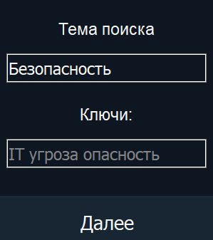
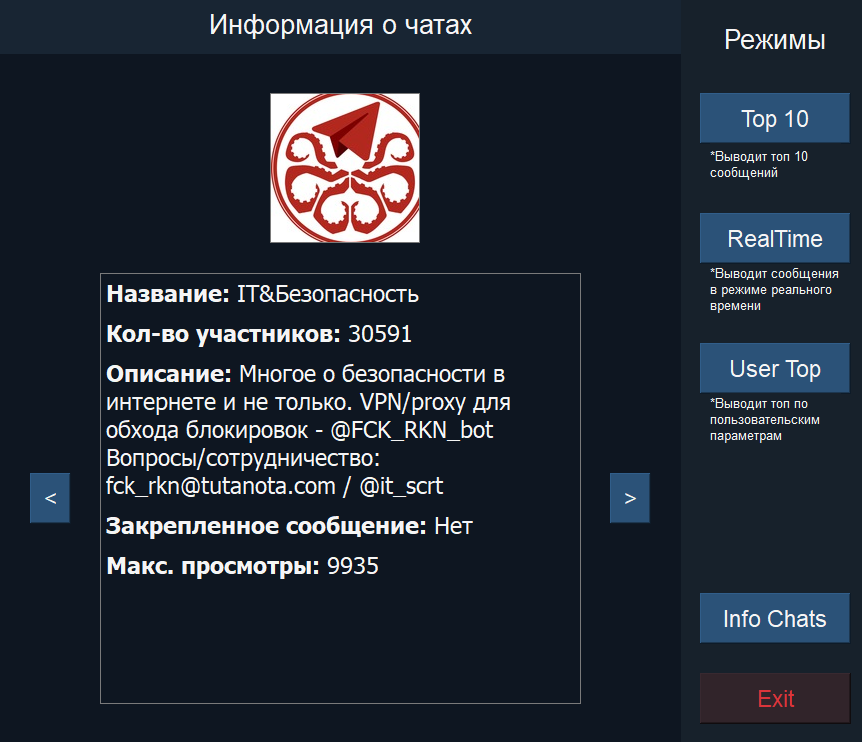
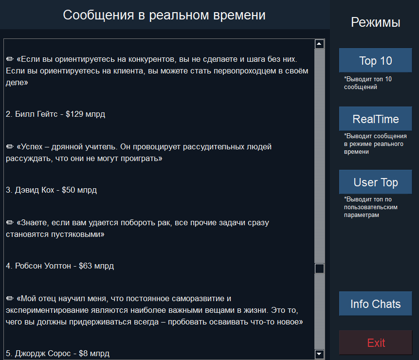
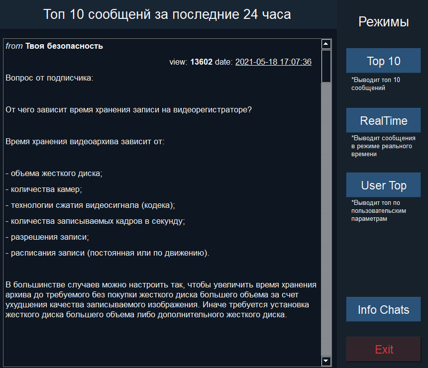
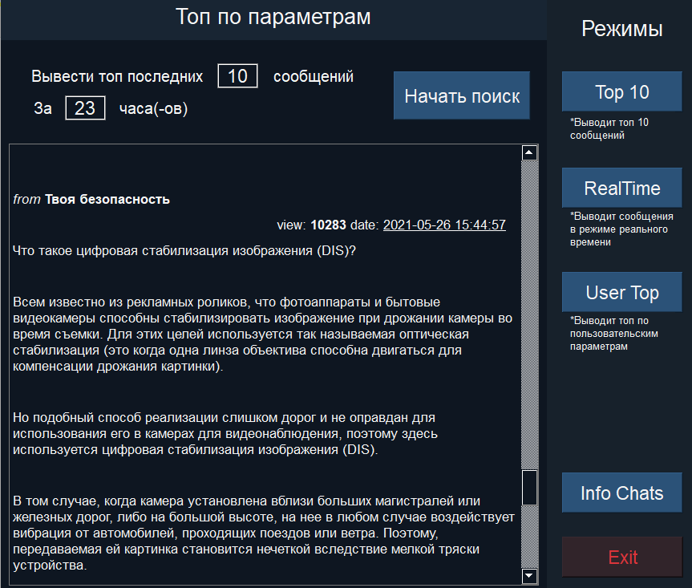

##Бот для автоматизированного поиска каналов Telegram по заданной теме

создан в рамках прохождения летней практики
## Ключевые инструменты
* [**Pyrogram**](https://docs.pyrogram.org)
* [**PyQt**](https://doc.qt.io/qtforpython/)
## Пример работы
### 1. Ввод данных

### 2. Окно с информацией найденных каналов

### 3.Режим работы с сообщениями в реальном времени

### 4.Режим топ 100 сообщений

### 5. Режим пользовательского составления топа
